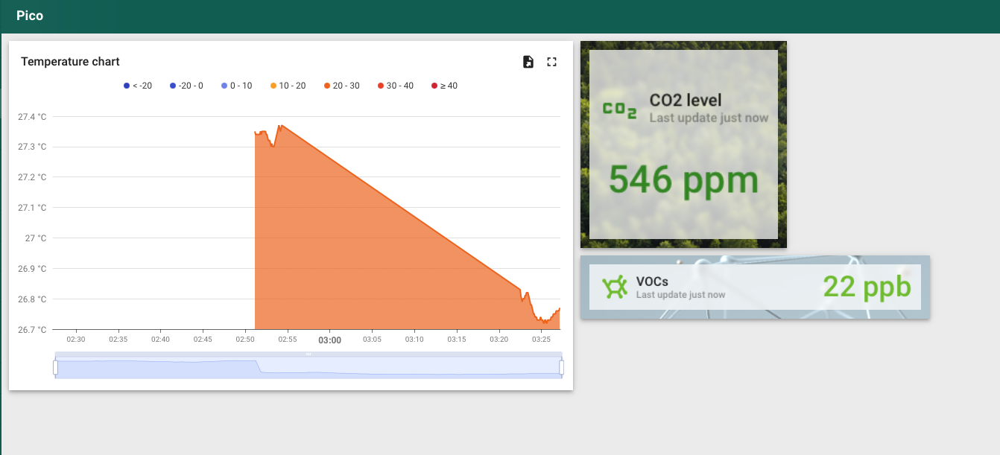

# nezumi-zephyr
----------------

For the initial attempt of this project, see [nezumi](https://github.com/irina-nita/nezumi).

Zephyr RTOS firmware that reads environmental sensor data and sends it to [ThingsBoard Cloud](https://thingsboard.cloud) over CoAP/DTLS.



## Summary

The device connects to WiFi, reads temperature, pressure, CO2, and TVOC measurements from I2C sensors, and publishes them as JSON telemetry to ThingsBoard every few seconds using the CoAP protocol secured with DTLS 1.2 and X.509 client certificates.


## Hardware

- **Raspberry Pi Pico W**
- **BMP280** (or BME280) for reading temperature and barometric pressure
- **CCS811** for reading eCO2 and TVOC air quality 

## Building

Place the X.509 credentials (ThingsBoard cloud CA root certificate, and the client certificate and key pair in the `certs/` directory) in raw binary (`der`) format. The build system will generate
before compilation byte arrays that are included in the `src/credentials.h` header.

```sh
west build -b rpi_pico/rp2040/w -p always
west flash # openocd needs to built from the `raspberrypi` fork
```

## Telemetry format

The device POSTs JSON to `coap.eu.thingsboard.cloud:5684` at `/api/v1/telemetry`:

```json
{"temperature": 22.50, "pressure": 1013.25, "co2": 412, "tvoc": 3}
```

